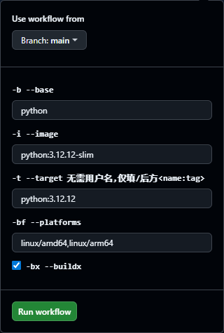

<div align="center">

# Docker Optimizer for China

# 优化中国网络环境下的Docker使用

</div>


# 简介

旨在解决在中国使用Docker及Docker镜像时的网络问题！加速镜像构建和依赖下载，节省使用Docker的时间，让Docker更丝滑！

* 由于官方 DockerHub 被墙，导致 `pull` `push` `login` 无法使用
  1. [解决 `pull` 问题：配置Docker镜像源](#配置镜像源)
  2. [解决 docker 所有命令的网络问题：配置Docker代理](#配置代理)
* 优化Docker镜像，解决镜像内 `包管理器(apt、apk)`  `Python Pip`  `Java Maven` 等工具或环境的默认源缓慢或被墙导致无法使用的问题
  1. 理论上支持所有镜像的优化
  2. 使用本仓库的脚本进行优化：将自动配置国内镜像源并重新构建镜像 [快速开始](#快速开始)
* 可优化本地镜像，某些镜像未push到中央仓库，仅在服务器本地存在，此时可clone本项目脚本到服务器，进行本地化的优化 [快速开始-本地镜像优化](#本地镜像优化)
* 亦可直接优化服务器，而非仅局限于Docker镜像 [直接优化服务器](#使用直接优化服务器)
* 极低侵入性：优化不会对原镜像做任何的其他修改，仅优化该优化了，比如：不会修改原有的工作目录、原有的启动命令、不夹带私货(不安装任何软件包)等
* 支持多平台架构镜像构建！


# 优化项

> * 关于镜像源的选择说明
>
>   优先使用的阿里源，因为在实际使用中，其他源都不太稳定且可能有限速或QPS限制（点名清华源，之前还挺好用的，现在一旦安装的包过多就被限制，下载包直接报错403）
>
> * 若你需要使用其他源，或其他优化，或其他调整，可根据 [快速开始](#快速开始) 进行完全属于你的自定义

- [x] 系统优化(通用)
  - [x] alias别名

- [x] Debian 系：`apt`
- [x] Ubuntu 系：`apt`
- [ ] Alpine:：`apk`
- [x] 环境优化
  - [x] Java Maven
  - [x] Python Pip
  - [x] Node.js Npm


# Docker自身优化

## Docker 安装

1. 推荐使用官方脚本一键安装，借助阿里云镜像

   此命令可一键安装当前最新版本的Docker，理论上所有发行版的Linux皆支持（只要Docker支持，那么都可以一键安装）

   ```shell
   curl -fsSL https://get.docker.com | bash -s docker --mirror Aliyun
   ```

2. 查看安装的版本信息，同时验证是否安装成功

   ```shell
   docker version
   ```

3. (可选) 关于 `docker-compose`

   目前最新版本已自带 `docker-compose`，无需手动单独安装，使用命令 `docker compose` 即可

   可能由于某些原因，仍需使用 `docker-compose` 命令，可设定别名

   ```shell
   # 临时（当前会话有效）
   alias docker-compose='docker compose'
   
   # 永久有效
   # 在 ~/.bashrc 文件末尾追加上方的别名设置命令即可
   # 目的就是让系统启动时就自动执行 alias 命令，因此，你也可以将此命令加到其他任意会在启动时自动执行的脚本中
   ```


## 配置镜像源

> 仅可解决使用 `docker pull` 无法拉取镜像
>
> 可选择 [配置代理](#配置代理) 解决所有Docker自身的网络问题，根据自身情况/使用场景，自行选择使用哪种方式，一般二选一即可

1. 添加镜像源配置，直接全选复制命令并粘贴执行

   ❗❗❗ 若 `daemon.json` 文件已存在，将覆盖已有配置，需自行确认是否可直接覆盖，否则请手动编辑配置

   ```shell
   mkdir -p /etc/docker &&
   tee /etc/docker/daemon.json <<-'EOF'
   {
     "registry-mirrors": [
       "https://0b27f0a81a00f3560fbdc00ddd2f99e0.mirror.swr.myhuaweicloud.com",
       "https://ypzju6vq.mirror.aliyuncs.com",
       "https://registry.docker-cn.com",
       "http://hub-mirror.c.163.com",
       "https://docker.mirrors.ustc.edu.cn",
       "https://docker.1ms.run",
       "https://docker.xuanyuan.me",
       "https://ghcr.nju.edu.cn"
     ],
     "dns" : [
       "114.114.114.114",
       "8.8.8.8",
       "8.8.4.4"
     ]
   }
   EOF
   ```

2. 重载配置并重启Docker

   ```shell
   systemctl daemon-reload && systemctl restart docker
   ```

3. 验证配置

   ```shell
   # 随便拉一个镜像测试一下即可
   # 能成功拉下来就算成功，因为目前docker.io是被墙了的，docker pull拉不下来任何东西
   docker pull alpine
   ```


## 配置代理

> 就类似设置系统代理一样，设置后可以直接访问外网，但对于Docker无效，因此需要单独配置Docker自身的代理
>
> 理论上可以解决Docker自身的所有网络问题：`pull` `push` `login` 等
>
> 配置代理后，可以无需 [配置镜像源](#配置镜像源)

1. 创建配置文件

   ```shell
   mkdir -p /etc/systemd/system/docker.service.d
   vi /etc/systemd/system/docker.service.d/http-proxy.conf
   ```

2. 编辑文件，新增如下内容

   ```ini
   [Service]
   Environment="HTTP_PROXY=http://192.168.1.2:10808"
   Environment="HTTPS_PROXY=http://192.168.1.2:10808"
   Environment="NO_PROXY=localhost,127.0.0.1"
   ```

3. 重载配置并重启Docker

   ```shell
   systemctl daemon-reload && systemctl restart docker
   ```

4. 验证配置

   ```shell
   # 执行命令
   docker info|sed -r '/Name/,$ !d'
   
   # 查看得到的结果，是否含义刚刚配置的代理信息，形如下
    Name: DESKTOP-E41TLDQ
    ID: cbfb0aa8-76b8-42df-a21c-986c9fcf2bed
    Docker Root Dir: /var/lib/docker
    Debug Mode: false
    HTTP Proxy: http://192.168.1.2:10808
    HTTPS Proxy: http://192.168.1.2:10808
    No Proxy: localhost,127.0.0.1
    Experimental: false
    Insecure Registries:
     ::1/128
     127.0.0.0/8
    Live Restore Enabled: false
   
   # 亦可随便拉一个镜像测试
   # 能成功拉下来就算成功，因为目前docker.io是被墙了的，docker pull拉不下来任何东西
   docker pull alpine
   # 也可以尝试验证其他命令是否正常可用，例如
   docker login -u username
   docker push xxx/xxx:latest
   ```


# 快速开始

## 开箱即用：直接使用我构建好的镜像

> 默认使用的基础镜像是各自的Debian系轻量镜像，详情可查看(优化并构建的镜像列表及基础镜像) [配置文件](./.github/workflows/build.yml#L68)
>
> 若默认的优化的镜像，不满足你的需求，支持完全自定义的优化，可继续往下看

本仓库已默认优化如下镜像，可直接使用（可能比列出的版本多，具体可查看DockerHub各个仓库页的Tags）

* [Java](https://hub.docker.com/r/candymuj/java/tags)
  
  * `8` `11` `17` `21`
  
* [Java Maven](https://hub.docker.com/r/candymuj/maven/tags)
  * `3.8.6 + jdk8` `3.8.6 + jdk11` `3.8.6 + jdk17`
  
  * `3.9.12 + jdk8` `3.9.12 + jdk11` `3.9.12+ jdk17` `3.9.12 + jdk21`
  
* [Python](https://hub.docker.com/r/candymuj/python/tags)
  * `3.10.11`
* [Node.js](https://hub.docker.com/r/candymuj/node/tags)
  * `24.12.0`
* [Nginx](https://hub.docker.com/r/candymuj/nginx/tags)
  * `1.28.1`


## 私有化自定义优化

### 前提：了解项目

* 主要关注如下几个文件即可

  1. base.sh

     * 这是一个优化脚本

     * 针对系统级别的优化，例如：各个系统的包管理器、别名等
     * 所有的镜像都将执行此脚本进行优化

  2. base-*.sh
     * 这是一个优化脚本
     * 针对不同的镜像类型的优化，例如：`base-python.sh` 就是优化 `Python` 的容器
     * 需以 `base-` 开头，后方的名称可任意命名，例如：`base-admin.sh` `base-xxx.sh` 皆可，只要在执行优化脚本时指定正确的 `base名称` 即可

  3. build.sh

     * 这是执行优化的入口

     * 基于 `base*.sh` 执行优化并构建

     * 通过 `sh build.sh -h` 查看脚本用法 更多示例可查看  [配置文件](./.github/workflows/build.yml#L68)

     * 亦可使用 `base build.sh` 或 `chmod +x build.sh && ./build.sh` 执行

       ```shell
       # 有 * 的表示必须的参数
       Usage: build.sh <option> <value>
               -b --base       : * 需要构建的镜像类型，对应 base-xxx.sh 系列脚本
               -i --image      : * 基于base使用的基础镜像，需要优化的镜像(一般是来自DockerHub的轻量镜像)
               -t --target     : * 构建的产物，构建后的最终镜像(未指定tag，默认将为latest) imagename<:tag>
               -bf --platforms : 指定构建的平台，多个以','分隔，默认构建当前单一平台 注意：仅开启buildx时才会生效
               -bx --buildx    : 使用buildx执行构建
               -bp --push      : 构建后同时执行推送
               -h --help       : 帮助信息
       
       # 示例
       # 使用 base.sh + base-java.sh 进行优化
       # 基于 jre8 的 openjdk:8u342-jre-slim 镜像
       # 最终生成的镜像为 candymuj/java:8
       # -bf linux/amd64,linux/arm64 -bx : 使用buildx执行多平台构建
       # -bp : 构建成功后推送到DockerHub
       sh build.sh -b java -i openjdk:8u342-jre-slim -t candymuj/java:8 -bf linux/amd64,linux/arm64 -bx -bp
       ```

* 所有的文件名建议不要有空格并且全小写

* 了解各个文件的作用后，你就可以在使用时根据自己的需求自行定制


### 使用：基于GitHub Actions

> 完全私有化、完全自定义的优化并构建自己的镜像
>
> 你可以调整/新增优化脚本，以满足自己的需求

1. [Fork](https://github.com/CandyMuj/DockerCN/fork) 本项目

2. 启用 [Actions](https://github.com/CandyMuj/DockerCN/actions)

3. 配置DockerHub账号

   必须配置，当使用 Actions 时，若不推送到仓库，则毫无意义；若无需推送请使用 [本地镜像优化](#使用本地镜像优化) 方式

   [前往 Add Actions Secret](https://github.com/CandyMuj/DockerCN/settings/secrets/actions/new) 添加如下变量

   * DOCKER_USERNAME : 用户名
   * DOCKER_PASSWORD : 密码

4. (可选) 若需要自定义优化或新增 `base-*.sh` 脚本，则自行调整脚本后推送至仓库再触发构建

5. 前往 [Actions Workflows](https://github.com/CandyMuj/DockerCN/actions/workflows/build.yml) 手动触发构建

   * 默认构建：不配置参数，执行默认构建；构建的镜像就是 [开箱即用中的镜像](#开箱即用直接使用我构建好的镜像)
   * 自定义构建：添加参数并且 `build.sh` 中的必填参数都配置后，将根据参数构建并优化单个镜像

     * 示例：

       * 使用 `base-python.sh` 脚本执行环境优化
       * 基于 `python:3.12.12-slim` 基础镜像
       * 最终构建并上传到DockerHub的镜像名为: `${{ secrets.DOCKER_USERNAME }}/python:3.12.12`
       * 使用 `buildx` 构建 `linux/amd64,linux/arm64` 多平台镜像

       


### 使用：本地镜像优化

> 没有账号或不想创建DockerHub账号、部分镜像可能涉及到隐私/保密等其他因素导致镜像仅在服务器本地存在，那么此时就可使用此方式优化并构建自己的镜像
>
> 同时也支持完全自定义：[同：基于GitHub Actions](#使用基于github-actions)

1. 克隆/下载本项目
2. 修改脚本
3. 执行 `build.sh` 详见：[了解项目](#前提了解项目)


### 使用：直接优化服务器

> 并非只有Docker镜像会遇到网络问题，部分情况下国内的服务器也会出现 `包管理器` `Python` 等工具的网络问题，此时可以直接运行此仓库的优化脚本实现优化

1. 克隆/下载本项目
2. 修改脚本
3. 执行 `bash.sh` 进行系统基础优化
4. 执行 `bash-*.sh` 进行其他环境优化


# 贡献

若有疑问或更好的建议，欢迎提交 [Issue](https://github.com/CandyMuj/DockerCN/issues) 和 [Pull Requests](https://github.com/CandyMuj/DockerCN/pulls)！

